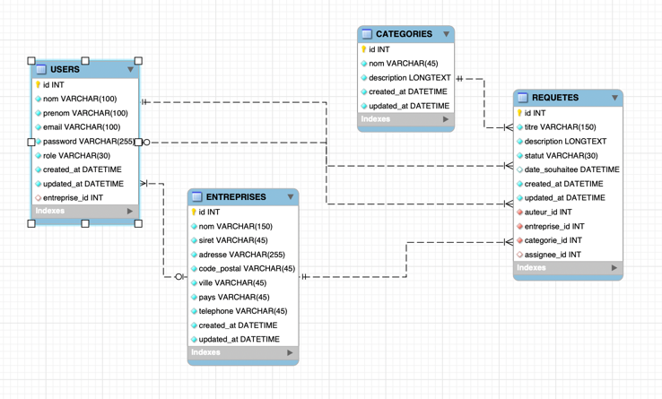

La base est organisée autour de 4 tables :

- USERS : contient tous les utilisateurs (clients + staff Maison Larbin), avec leurs infos de connexion et leur role.
- ENTREPRISES : contient les entreprises clientes.
- CATEGORIES : contient les catégories de demandes/services.
- REQUETES : contient les demandes envoyées via le formulaire.

Relations :

USERS.entreprise_id -> ENTREPRISES.id

- Un utilisateur peut être rattaché à une entreprise cliente 
- Utile pour employe, cadre, direction
- Nullable car les rôles staff_* ne sont pas rattachés à une entreprise cliente

REQUETES.auteur_id -> USERS.id

- Utilisateur qui crée la requête (ex: cadre)

REQUETES.assignee_id -> USERS.id

- Membre du staff qui traite la requête
- Nullable car une requête peut être non assignée au départ

REQUETES.entreprise_id -> ENTREPRISES.id

- Entreprise concernée par la requête

- REQUETES.categorie_id -> CATEGORIES.id

- Catégorie de la requête

En résumé :

ENTREPRISES regroupe les utilisateurs clients
USERS gère les rôles et les comptes
REQUETES centralise les demandes
CATEGORIES permet de classer les demandes

